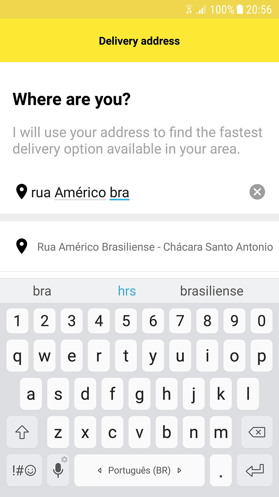
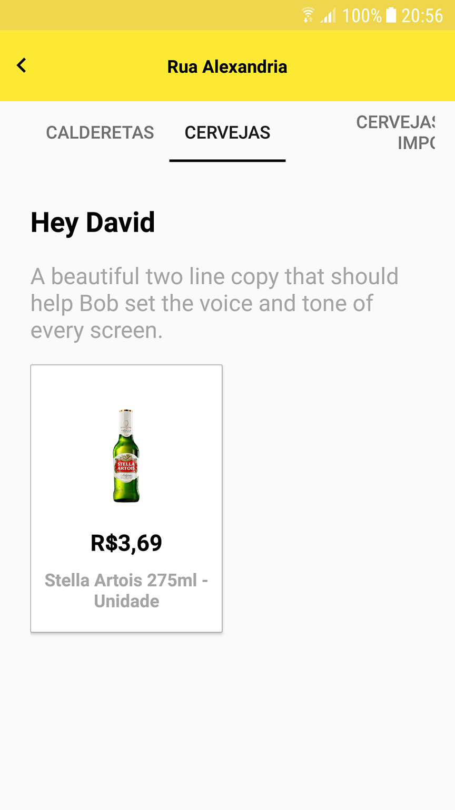
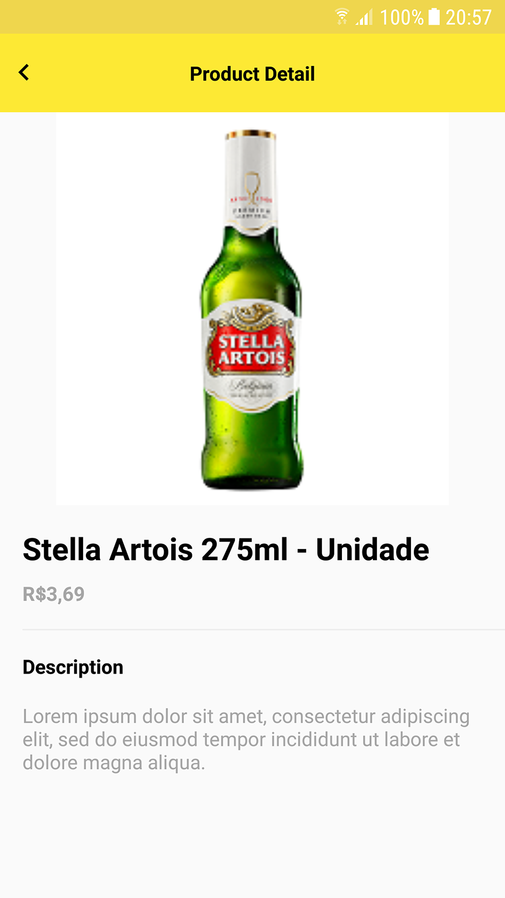

# Android Courier Delivery App

This project is a simple example of a Delivery Application which consumes data from a GraphQL server.

## Getting Started

In order to use this Application you need a Google Api Key to use the [Google's Place Autocomplete Service](https://developers.google.com/places/web-service/autocomplete).
Follow the instructions in the link and when you receive your Key change the content of the GOOLE_API_KEY in the file com.app.courier.utils.Constants to you Api Key.


```
public static final String GOOLE_API_KEY = "YourGoogleApiKey";
```

### Prerequisites

This app was built using the Android Gradle Plugin Version 2.3.3.
You will also need to configure the [Android Apollo Plugin and Library](https://github.com/apollographql/apollo-android) and Generate the Schemas for the project.
In order to generate the schemas you can use the [Apollo Code Generator](https://www.npmjs.com/package/apollo-codegen).

### 3D Party Libraries

This app makes use of the following 3D party libraries:

* [OkHttp](http://square.github.io/okhttp/) to perfom HTTP requests
* [Picasso](http://square.github.io/picasso/) to fetch images from URL and cache them
* [Apollo](https://github.com/apollographql/apollo-android) to get data from GraphQL api

## Acknowledgments
* Hat tip to anyone who's code was used
* StackOverflow
* Linus Torvalds



